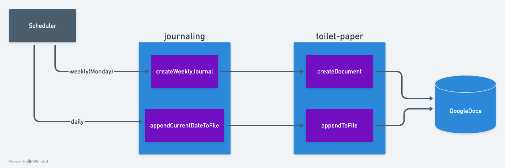
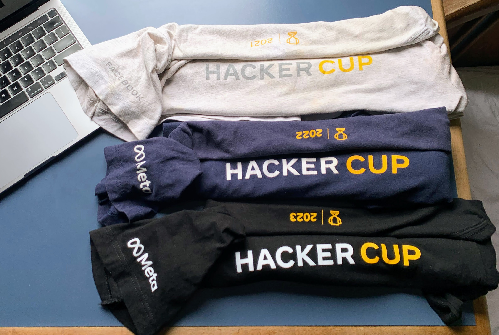

## Summary

- [Summary](#summary)
- [Personal](#personal)
- [System Design](#system-design)
- [Competitive Programming](#competitive-programming)

## Personal

- **[Interview Preparation](https://github.com/gardusig/road2senior/):** Strategies, tips, and resources to help you ace different types of interviews, including coding, behavioral, and system design.
- **[Resume](./resume/resume.pdf):** My professional resume, showcasing my experience, skills, and achievements.
  
## System Design

Explore the systems I've created to demonstrate my design skills and approach to solving complex problems:

- **[Generic Node Service](https://github.com/gardusig/genericNodeService):** A scalable and modular server-side application built with Node.js using the NestJS framework, designed to handle various backend functionalities such as API management, authentication, and database operations while ensuring high performance and reliability.
    
- **[Journaling](https://github.com/gardusig/journaling):** A Google Apps Script-based system to automate the creation and management of journaling documents in Google Drive.
    

## Competitive Programming

These experiences have sharpened my skills in algorithm design, data structures, and programming under pressure, making me adept at tackling complex problems quickly and effectively.

- **[Codeforces](https://codeforces.com/)/[CodeChef](https://www.codechef.com/):** Achieved First Division status on both platforms.
- **[ICPC Latin America Finals](https://icpc.global/):** Competed in 4 regional finals.
- **[Meta HackerCup](https://www.facebook.com/codingcompetitions/hacker-cup):** Earned 3 consecutive T-shirts.
    