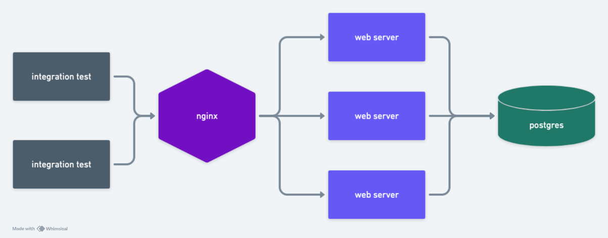

## GenericNodeService

A [scalable and modular server-side application](https://github.com/gardusig/genericNodeService) built with Node.js, using the NestJS framework to provide a structured and efficient architecture. This service is designed to handle various backend functionalities, including API management, authentication, and database operations, while ensuring high performance and reliability.

The application supports both local and containerized deployments using Docker, providing flexibility in development and deployment environments. It includes robust testing capabilities, following best practices for continuous integration and deployment. Additionally, the service utilizes Prisma for managing database migrations and interactions, ensuring seamless data handling and schema management.

This Node.js service serves as a core backend component in distributed systems, enabling secure and efficient communication with various clients and services.
